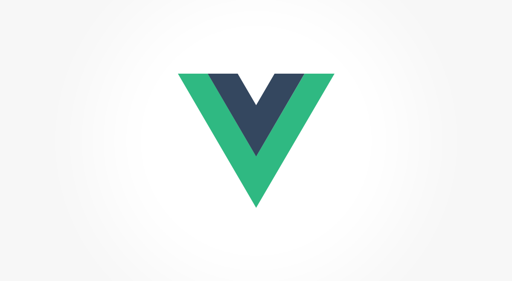

# vue-minimal
> A minimal starter kit for Vue with Webpack, Babel, SASS &amp; CSS Modules.



As the name says, this is *another* Vue starter kit created to give the minimum-viable-configuration to get started a new Vue based project with less dependencies and boilerplate as possible.

Developed mainly for me 😎 but open to everyone who may find this useful.

* Vue
* Webpack
  * HTML plugin
* SASS & normalize.css
* Styles loaded as CSS Modules
* Babel, with the `env` preset
* gh-pages (publish)

## Get started
A few steps to quick-start a new project:

Clone the repo on a new folder
```
$ git clone https://github.com/moebiusmania/vue-minimal my-project
```

Change the name in the `package.json`, this will also affect the HTML title and the Webpack's notifications:
```json
...
  "name": "my-project"
...
```

then

```
$ yarn
```
to install dependencies, and

```
$ yarn start
``` 
to start webserver on `localhost:3000`

## Build & publish

To create deployable static files in the `./dist` folder:
```
$ yarn build
```

to deploy the `./dist` folder as a Github page:
```
$ yarn deploy
```

## Styles
This starter kit supports both regular CSS and SASS, with a little difference in how they are managed:

* `.css` files are loaded as style tag in the main document, this is great for global styles and precompiled libraries.
* `.scss` files are loaded as CSS modules, this is a best fit for components.

## Changelog
Check the [releases page](https://github.com/moebiusmania/vue-minimal/releases/) to get updated on what changed in the latest version.

## License
Released under the [MIT license](LICENSE).